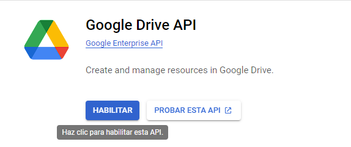
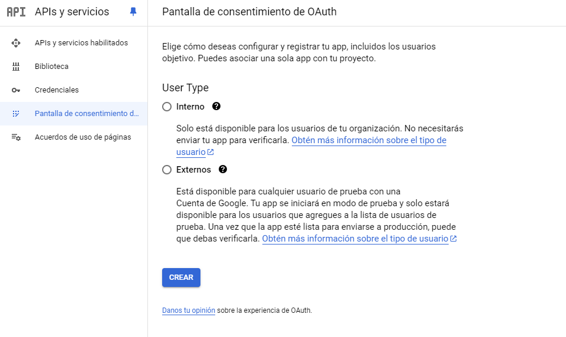
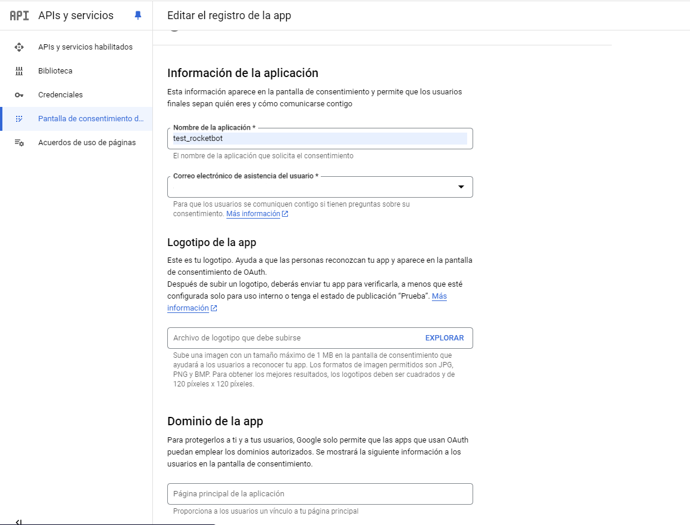
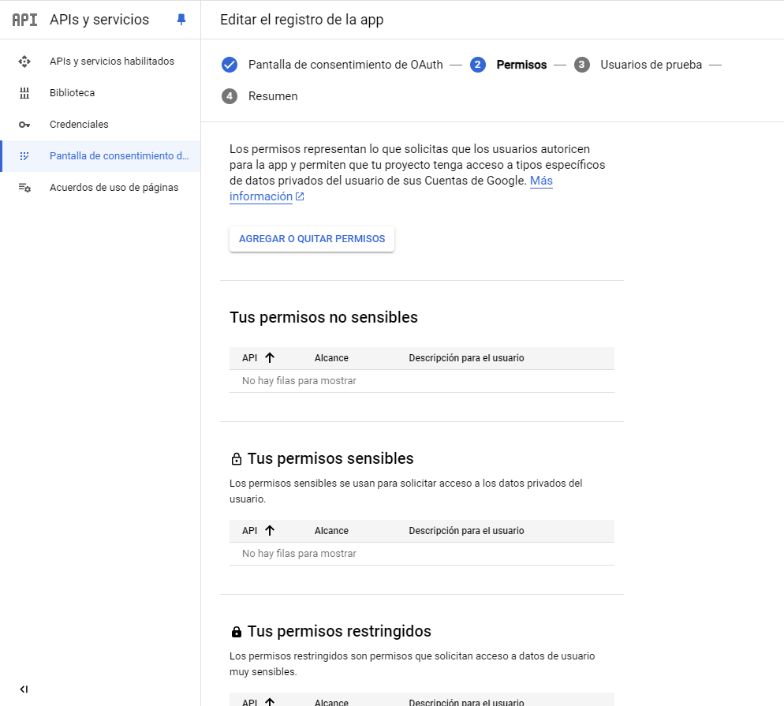
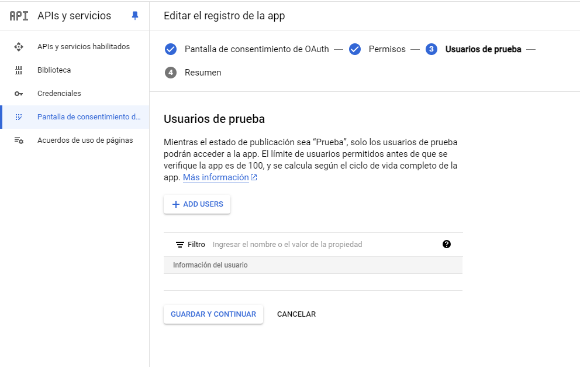
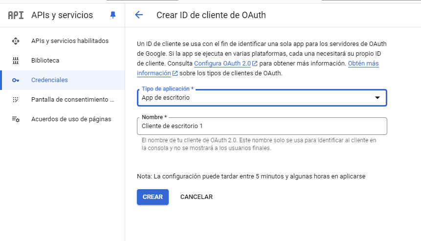
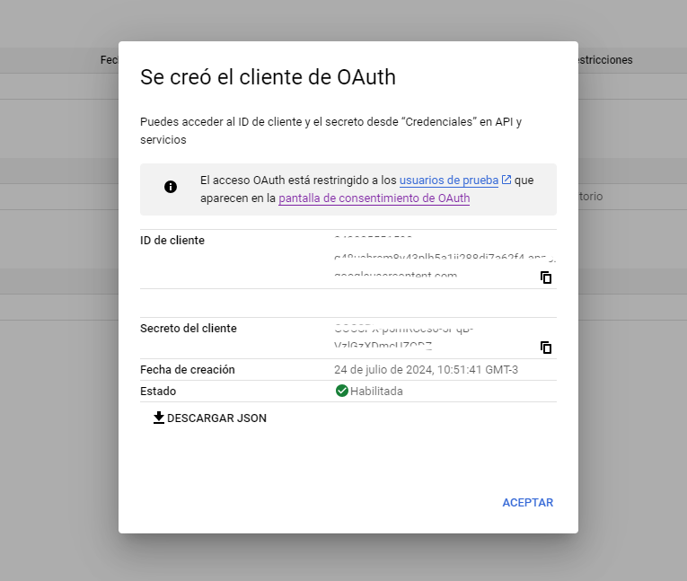

# Google Drive
  
Módulo para conectar ao Google Drive e gerenciar seus arquivos. Você pode trabalhar com arquivos e pastas próprios ou compartilhados, mover, excluir, baixar, exportar e carregá-los.  

*Read this in other languages: [English](Manual_gdrive.md), [Português](Manual_gdrive.pr.md), [Español](Manual_gdrive.es.md)*
  

## Como instalar este módulo
  
Para instalar o módulo no Rocketbot Studio, pode ser feito de duas formas:
1. Manual: __Baixe__ o arquivo .zip e descompacte-o na pasta módulos. O nome da pasta deve ser o mesmo do módulo e dentro dela devem ter os seguintes arquivos e pastas: \__init__.py, package.json, docs, example e libs. Se você tiver o aplicativo aberto, atualize seu navegador para poder usar o novo módulo.
2. Automático: Ao entrar no Rocketbot Studio na margem direita você encontrará a seção **Addons**, selecione **Install Mods**, procure o módulo desejado e aperte instalar.  

## Como usar este módulo

Antes de utilizar este módulo, é necessário cadastrar sua aplicação no portal Google Cloud. Para isso, você deve seguir os seguintes passos:

1. Acesse o [Google Console](https://console.cloud.google.com/projectcreate?previousPage=%2Fhome%2Fdashboard) para criar um novo projeto (se você já tiver um criado, pule esta etapa) e conclua o dados indicados no formulário

Na barra superior você verá o nome do projeto. Caso não seja exibido, mude para o projeto criado clicando no menu destacado na imagem.

2. Vá para **API e Serviços** no painel esquerdo e após mudar para a página, clique em **ATIVAR APIS E SERVIÇOS**

3. No mecanismo de pesquisa "Pesquisar APIs e serviços", digite **Google Drive API**. Em seguida, habilite a API clicando em **Ativar**

Você será redirecionado para a página de configuração da API.

4. No painel lateral 
clique em **Tela de consentimento do OAuth**, se você tiver uma conta corporativa do Gmail, poderá usar a API indefinidamente e verá que o tipo de usuário é **Interno**. Se você tiver uma conta gratuita do Gmail, terá que dar consentimento uma vez por semana para poder se conectar à sua conta de e-mail. Seu tipo de usuário é **Externo** e você terá que adicionar usuários de teste. Em seguida, pressione o botão **Criar**

5. Selecione o nome do aplicativo e os campos obrigatórios de acordo com cada caso. Em seguida, clique em próximo.

6. Ignore a tela **Permissões** e clique no botão Salvar e Continuar na parte inferior da página.

7. Na tela **Usuários de teste** clique no botão **Adicionar usuário** e adicione seu usuário. Clique em Salvar e continuar

8. Vá do menu de navegação à esquerda para **Credenciais**. Pressione **+Criar credenciais** e insira a opção **ID do cliente 
OAuth**

9. Selecione o tipo de aplicativo: **Aplicativo de desktop**. Insira um nome para o aplicativo e pressione o botão **Criar**

10. Irá criar as credenciais, se quisermos fazer o login com o arquivo json clicamos em **Baixar JSON** e depois em **Aceitar**. É importante manter o arquivo baixado. Ele será usado posteriormente no módulo. Se quisermos fazer login com as credenciais, salvamos o Client ID e o Secret ID para usar posteriormente no módulo.

Nota: Quando a primeira conexão for feita, um arquivo .pickle será criado na pasta raiz do Rocketbot, para conectar ao mesmo serviço de outra conta, você precisa deletar
esse arquivo Faça o mesmo procedimento caso as credenciais expirem.
## Descrição do comando

### Configurar credenciais do G-Suite
  
Configurar credenciais do Google Drive
|Parâmetros|Descrição|exemplo|
| --- | --- | --- |
|Caminho de credenciais|Arquivo JSON com as credenciais de acesso ao API do Google Drive.|C:\Usuario\Desktop\credentials.json|
|Porto (Opcional)||8080|
|Session||session|

### Login sem arquivo json
  
Login no Google Drive sem arquivo json
|Parâmetros|Descrição|exemplo|
| --- | --- | --- |
|Client ID|ID do cliente do console da Google Cloud Platform.|123456789012-xxxxxxxxxxxxxxx.apps.googleusercontent.com|
|Client Secret|Segredo do cliente do console da Google Cloud Platform.|GOCSPX-xxxxxxxxx_Dc9TGFy32_xxxxxxxx|
|Porto (Opcional)||8080|
|Session||session|

### Listar arquivos no Drive
  
Listar arquivos do Google Drive. Este comando retorna todos os arquivos por padrão, incluindo arquivos descartados. Se você não quiser que os arquivos da lixeira apareçam na lista, use trashed=false como filtro.
|Parâmetros|Descrição|exemplo|
| --- | --- | --- |
|Filtro||mimeType = 'application/vnd.google-apps.folder' and trashed = false|
|Somente arquivos próprios||-|
|Somente arquivos compartilhados comigo||-|
|Mais dados||-|
|Atribuir resultado à variável||var|
|Session||session|

### Baixar arquivo
  
Baixar um arquivo do Drive
|Parâmetros|Descrição|exemplo|
| --- | --- | --- |
|ID do Arquivo (Drive)||1iySKcDSSHoRxjlNBS4WIANMi9RLp-t8mwYmc-61cvTo|
|Caminho onde salvar o arquivo||C:\users\usuario\Downloads|
|Session||session|

### Baixar pasta
  
Baixar uma pasta do Drive
|Parâmetros|Descrição|exemplo|
| --- | --- | --- |
|ID da Pasta (Drive)||1iySKcDSSHoRxjlNBS4WIANMi9RLp-t8mwYmc-61cvTo|
|Caminho onde salvar a pasta||C:\users\usuario\Downloads|
|Session||session|
|Atribuir resultado à variável|Devolverá True ou False dependendo do resultado da execução.|var|

### Exportar arquivo
  
Exportar um arquivo do Drive para o tipo de formato solicitado
|Parâmetros|Descrição|exemplo|
| --- | --- | --- |
|ID do Arquivo (Drive)||1iySKcDSSHoRxjlNBS4WIANMi9RLp-t8mwYmc-61cvTo|
|Formato de arquivo (Drive)||---- Select format ----|
|Caminho onde salvar o arquivo||C:\users\usuario\Downloads|
|Session||session|

### Criar pasta
  
Criar pasta
|Parâmetros|Descrição|exemplo|
| --- | --- | --- |
|ID do Arquivo (Drive)||1iySKcDSSHoRxjlNBS4WIANMi9RLp-t8mwYmc-61cvTo|
|File path||New Folder|
|Atribuir resultado à variável||var|
|Session||session|

### Copiar ou mover arquivo
  
Copiar ou mover um arquivo
|Parâmetros|Descrição|exemplo|
| --- | --- | --- |
|ID do Arquivo (Drive)||1iySKcDSSHoRxjlNBS4WIANMi9RLp-t8mwYmc-61cvTo|
|Destiny Folder ID||1iySKcDSSHoRxjlNBS4WIANMi9RLp-t8mwYmc-61cvTo|
|Mover ou Copiar||var|
|Atribuir resultado à variável||var|
|Session||session|

### Subir arquivo
  
Carregar um arquivo para o Google Drive
|Parâmetros|Descrição|exemplo|
| --- | --- | --- |
|Caminho de arquivo||C:\archivo.txt|
|Novo nome (opcional)||new_name.txt|
|Salvar na pasta - ID (opcional)||1iySKcDSSHoRxjlNBS4WIANMi9RLp-t8mwYmc-61cvTo|
|Converter para o formato Google|Se marcado, ele tentará fazer o upload do arquivo no formato equivalente do Google (se houver), caso contrário, fará o upload do arquivo original.||
|Atribuir resultado à variável||var|
|Session||session|

### Subir pasta
  
Carregar uma pasta para o Google Drive
|Parâmetros|Descrição|exemplo|
| --- | --- | --- |
|Caminho da pasta||C:\folder|
|Salvar na pasta - ID (opcional)||1iySKcDSSHoRxjlNBS4WIANMi9RLp-t8mwYmc-61cvTo|
|Novo nome (opcional)|Novo nome para a pasta raíz a ser carregada. Opcional.|new_name|
|Converter para o formato Google|Se marcado, ele tentará fazer o upload do arquivo no formato equivalente do Google (se houver), caso contrário, fará o upload do arquivo original.||
|Atribuir resultado à variável||var|
|Session||session|

### Excluir um arquivo ou pasta
  
Excluir um arquivo ou pasta do Google Drive
|Parâmetros|Descrição|exemplo|
| --- | --- | --- |
|ID do Arquivo (Drive)||1iySKcDSSHoRxjlNBS4WIANMi9RLp-t8mwYmc-61cvTo|
|Atribuir resultado à variável||var|
|Session||session|

### Compartilhar arquivo
  
Compartilhar um arquivo do Drive
|Parâmetros|Descrição|exemplo|
| --- | --- | --- |
|ID do Arquivo (Drive)||1iySKcDSSHoRxjlNBS4WIANMi9RLp-t8mwYmc-61cvTo|
|Tipo||---- Select ----|
|Papel||---- Select ----|
|E-mail ou Domínio|||
|Enviar e-mail de notificação||-|
|Transferir propriedade||-|
|Mover arquivo para a pasta raiz do novo proprietário||-|
|Atribuir resultado à variável||var|
|Session||session|

### Gerenciar permissoes da pasta
  
Cria, atualiza ou exclui uma permissão da pasta. Os tipos de acesso são de usuários: User ou Group, e de acesso geral: Domain ou Anyone.
|Parâmetros|Descrição|exemplo|
| --- | --- | --- |
|ID da pasta (Drive)||1iySKcDSSHoRxjlNBS4WIANMi9RLp-t8mwYmc-61cvTo|
|Ação||---- Select ----|
|Tipo de Acesso||---- Select ----|
|Papel||---- Select ----|
|E-mail, Domínio ou PermissionID|||
|Enviar e-mail de notificação||-|
|Atribuir resultado à variável||var|
|Session||session|

### Listar permissões
  
Obtenha uma lista de permissões de um arquivo
|Parâmetros|Descrição|exemplo|
| --- | --- | --- |
|ID do Arquivo (Drive)||1iySKcDSSHoRxjlNBS4WIANMi9RLp-t8mwYmc-61cvTo|
|Atribuir resultado à variável||var|
|Session||session|

### Excluir permissão
  
Excluir uma permissão de um arquivo
|Parâmetros|Descrição|exemplo|
| --- | --- | --- |
|ID do Arquivo (Drive)||1iySKcDSSHoRxjlNBS4WIANMi9RLp-t8mwYmc-61cvTo|
|ID do Permissão (Drive)||15224413836718185781|
|Atribuir resultado à variável||var|
|Session||session|
